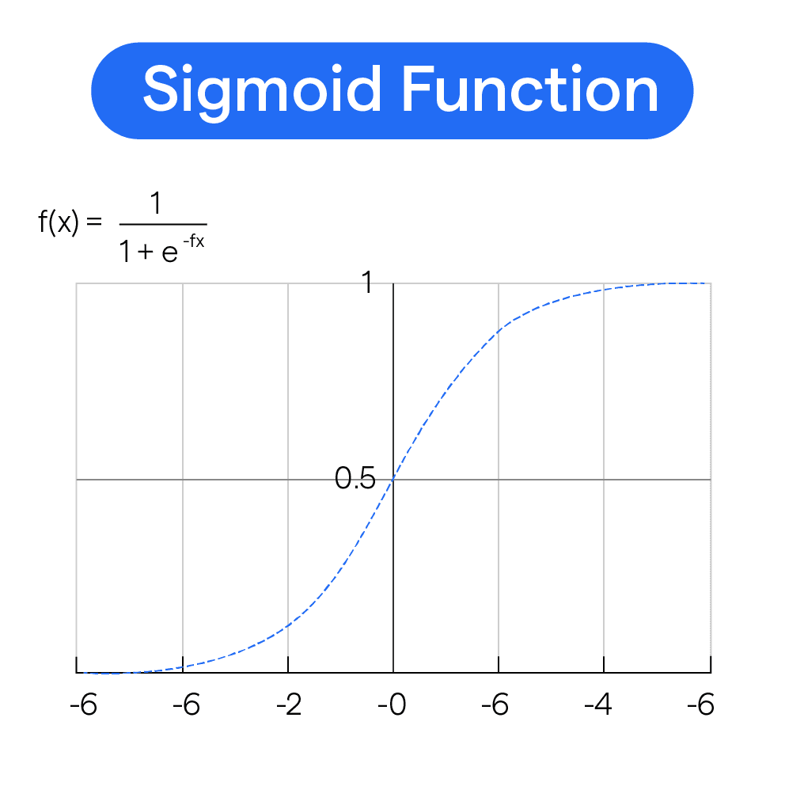
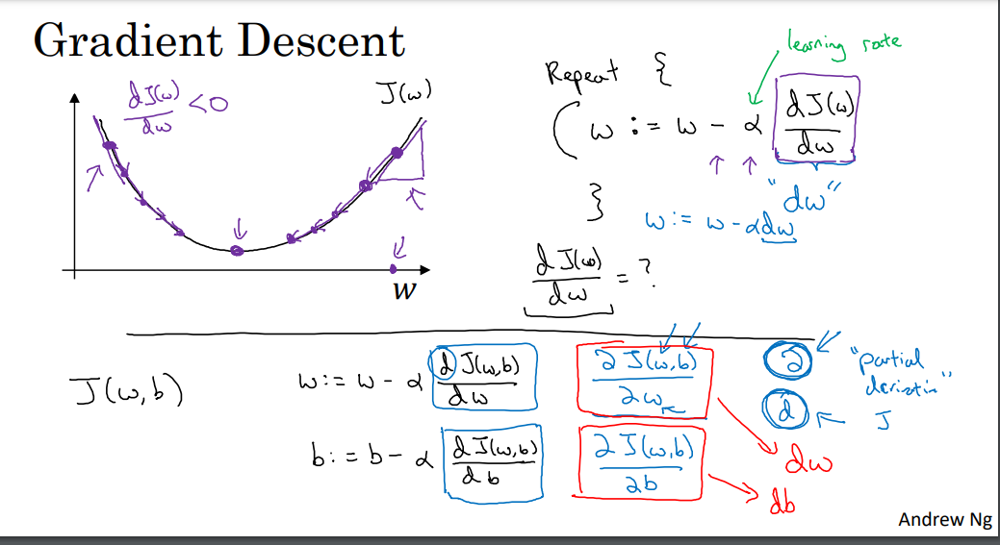
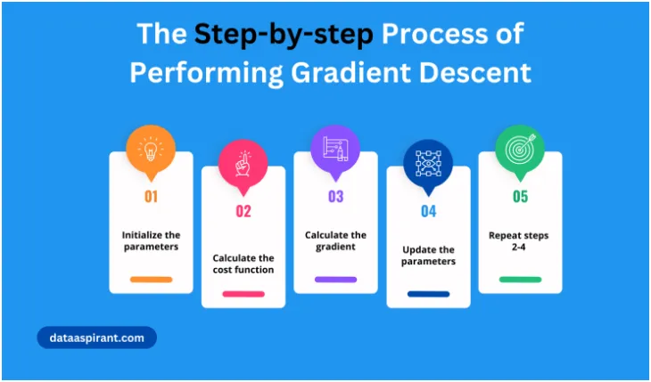

# Logistic Regression Implementation
- [Logistic Regression Implementation](#logistic-regression-implementation)
  - [Binary Classification](#binary-classification)
  - [Logistic Regression](#logistic-regression)
    - [Overview](#overview)
    - [2. Dive into it](#2-dive-into-it)
      - [2.1 Loss Function](#21-loss-function)
      - [2.2 Cost Function](#22-cost-function)
      - [2.3 Gradident Descent](#23-gradident-descent)
      - [Next part](#next-part)
      - [Knowledges](#knowledges)
  - [Coding](#coding)
## Binary Classification

Given an image how can we determine it is a cat (1) or non-cat (0).

<!-- Image -->

- Input (X): A random image

- Output (Y): 1 for cat, 0 otherwise.

How does a computer work with an image?  
1. Using **3 separate matrices for RGB**(Red, Green, Blue).

    ( Suppose the image size is 64x64. We will need those 3 matrices with the same size, then the total cells we need is 3x64x64 = 12288 cells )
2. Take the feature vector by **unroll** these matrices

    (We would have a shape (12288,1) vector at the end)

## Logistic Regression

### Overview
Given $x$, we want to find ${ŷ} = P(y=1|x) $

|Notation| Meaning|
|--------|--------|
|nx| number of features (12288)|
|m| number of training samples|
|x| (nx*m) matrices|
|y| labeled values for each x|
|ŷ| predicted y|

The target that we are finding is a function which return the **possibility of being a cat** picture of the input.
1. Parameter: $w$ (vector shape (nx,1)), $b$ a real number.
2. Output:  
     ${z} = \mathbf{w}^T \mathbf{x} + b$
    
    But in this formula, **z is in range (-inf,inf) which we need to limit into [0,1]** (because the possibility is in this range). It's the time for the [activation function](https://en.wikipedia.org/wiki/Activation_function). In this case, we use ([sigmoid function](https://en.wikipedia.org/wiki/Sigmoid_function))

    ${ŷ} = \sigma(z)$

    

### 2. Dive into it
So, how we can find $w$ and $b$?
1. Find the [Loss Function](#21-loss-function) 
2. Find the [Cost Function](#22-cost-function) (average of Cost Function) 
3. Minimize the cost by using [Gradient Descent](#23-gradident-descent)

#### 2.1 Loss Function
$\mathcal{L}(\mathbf{y_{\hat{i}}}, y_i) = - [y_i \log(y_{\hat{i}}) + (1 - y_i) \log(1 - y_{\hat{i}})]$

#### 2.2 Cost Function
Cost Function is the average of Loss for all the sample.
$J(\mathbf{w}, b) = \frac{1}{m} \sum_{i=1}^{m} \mathcal{L}(\mathbf{y_{\hat{i}}}, y_i)$

The **lower the cost function**, the **more accurate the model performs**.

So how can we find the lowest or near lowest cost? **Find the global minima** of the Cost Function J is the answer.

#### 2.3 Gradident Descent
Gradient descent is necessary for optimizing and fine-tuning the parameters of a machine-learning model. In fact, it is the backbone of many machine-learning algorithms.

To perform the gradient descent, we iteratively update the variables (parameters) according to the following rule:

$x_{\text{new}} = x_{\text{old}} - \alpha \nabla f(x_{\text{old}})$

Where:

+ $x_{\text{new}}$ represents the updated values of the variables$

+ $x_{\text{old}}$ represents the current values of the variables$

+ $\alpha$ is the learning rate$

+ $\nabla f(x_{\text{old}})$ is the gradient of the function $f$ evaluated at the current values of the variables $x_{\text{old}}$

#### Next part
The next part is just to find the derivatives of $w$ and $b$, apply Gradient Descent `n_iterations` times in order to find the optimize weight and bias. Then use it to predict with the new images.

I'm too lazy to write down the step-by-step process of solving these math exercises. You can look at the code or do some simple searching for better knowing

And the best is that you can spend 30 mins to watch the video on Coursera week 2. I've linked in the [Knowledge](#knowledges).

#### Knowledges
1. [Neural Networks and Deep Learning - DeepLearning.AI](https://www.coursera.org/learn/neural-networks-deep-learning/home/week/2)
2. [Deep Learning (Part 8)-Gradient Descent of Logistic Regression - Medium](https://medium.com/@Coursesteach/deep-learning-part-8-05718b250906)
3. [Sigmoid function - Wikipedia](https://en.wikipedia.org/wiki/Sigmoid_function)
4. [Activation function - Wikipedia](https://en.wikipedia.org/wiki/Activation_function)

## Coding
Have a look at [`Logistic_Regression_with_a_Neural_Network_mindset.ipynb`](./Logistic_Regression_with_a_Neural_Network_mindset.ipynb).
